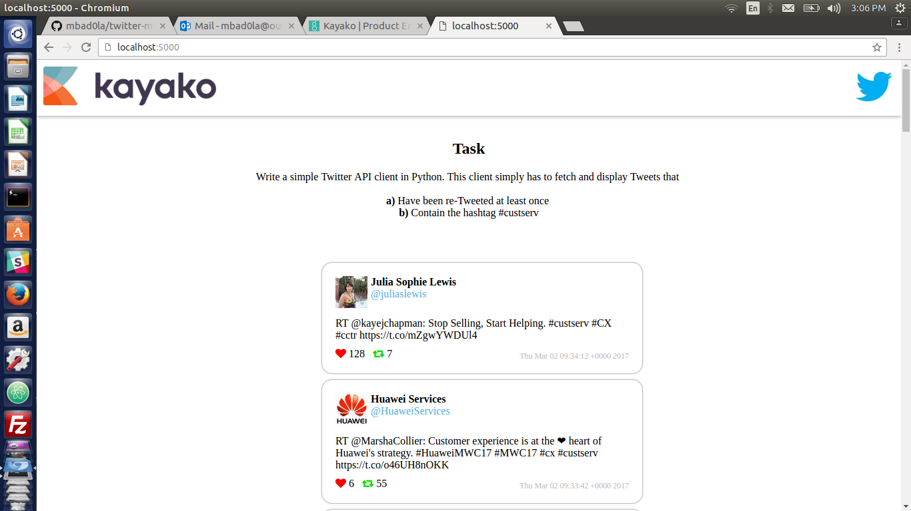
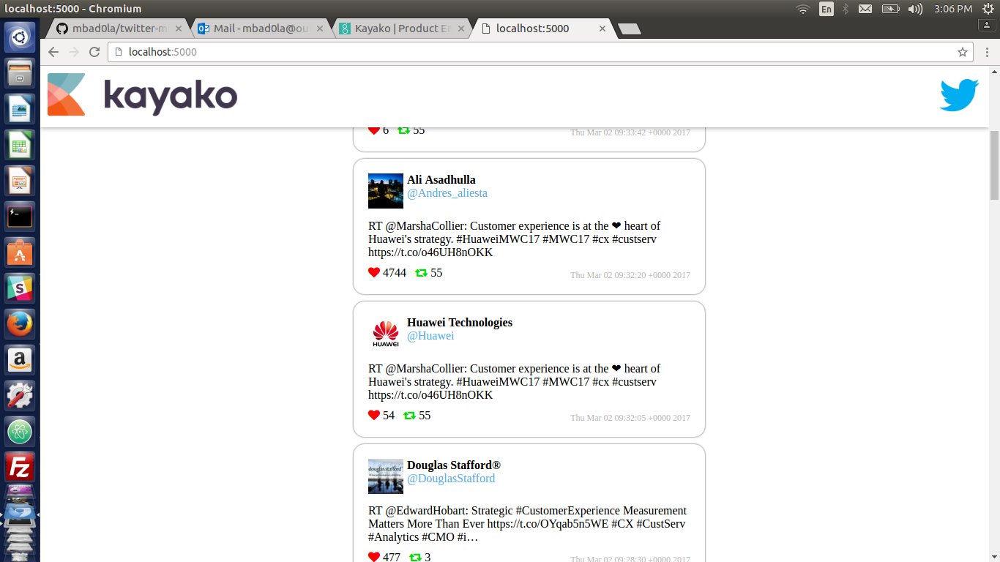

# Twitter-Mini-Feed
Challenge Task for Kayako

## Task
Write a simple Twitter API client in any language of your choice. This client simply has to fetch and display Tweets that a) Have been re-Tweeted at least once and b) Contain the hashtag #custserv

## Screenshots




## Development
Clone this repository using
```
git clone https://github.com/mbad0la/twitter-mini-feed.git
```
Navigate into the repository and initialise a virtual environment
```
virtualenv venv
```
Activate the virtual environment using
```
source venv/bin/activate
```
and install the python dependencies
```
pip install -r requirements.txt
```
Create a `credentials.py` file and add your application's consumer key and secret as :
```
# crendentials.py
CONSUMER_KEY = 'your api key'
CONSUMER_SECRET = 'your api secret'
```
You can now start the development server using
```
python main.py
```
Access your app at `localhost:5000`

## Project Dependencies
Major dependencies of this project are :
* Flask, a lightweight web framework
* Requests, http library for python
* jQuery, JavaScript library for the frontend

### API endpoints
* `/api/<hashtag>`

  Fetches the latest tweets which have `@hashtag` in them and their retweet count is atleast 1

### Twitter Client
Get latest tweets having a certain `hashtag` and having a threshold retweet `count` by :
```python
from twitter_client import TwitterClient
from credentials import CONSUMER_KEY, CONSUMER_SECRET

twitter = TwitterClient(CONSUMER_KEY, CONSUMER_SECRET)

print twitter.search.tweets_by_hashtag(hashtag=hashtag, retweet_threshold=count)
```
